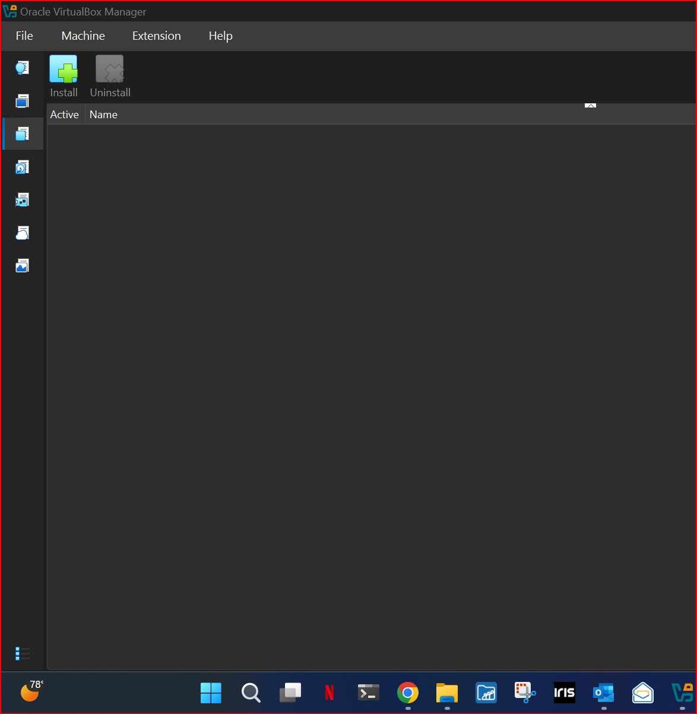
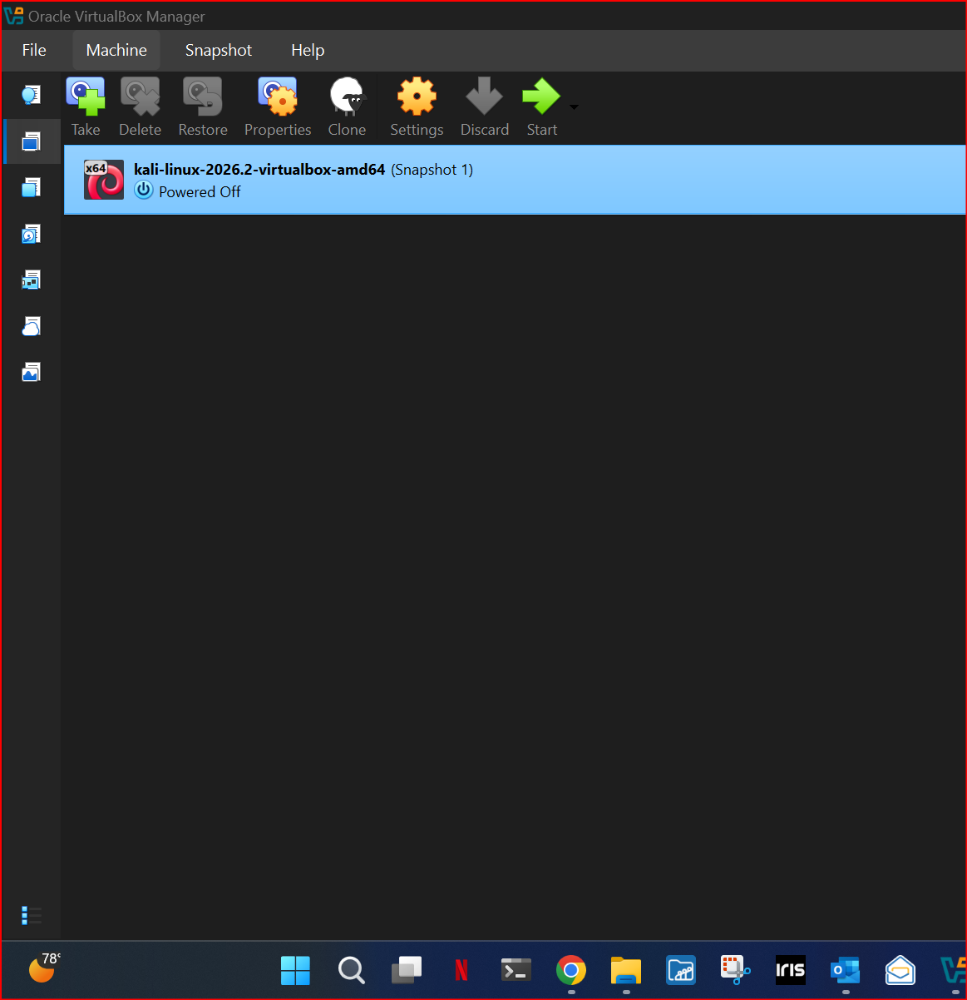
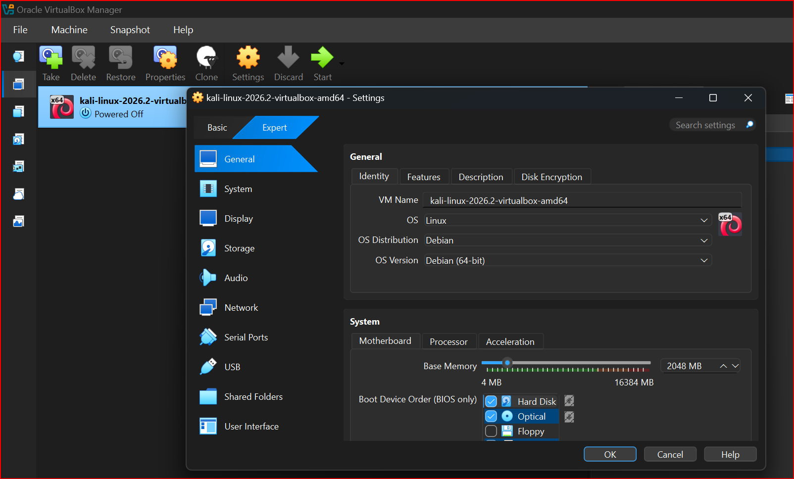
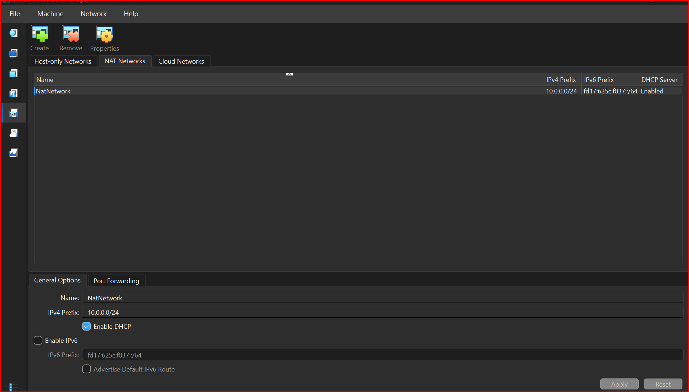
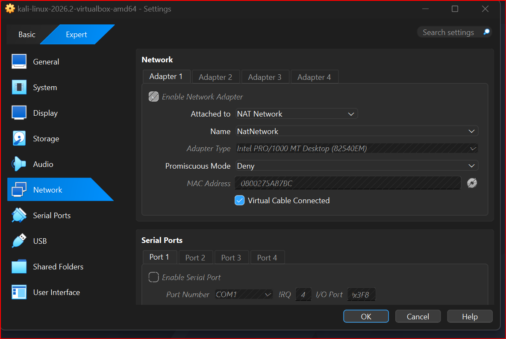
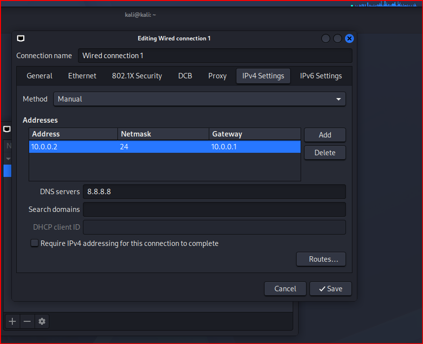
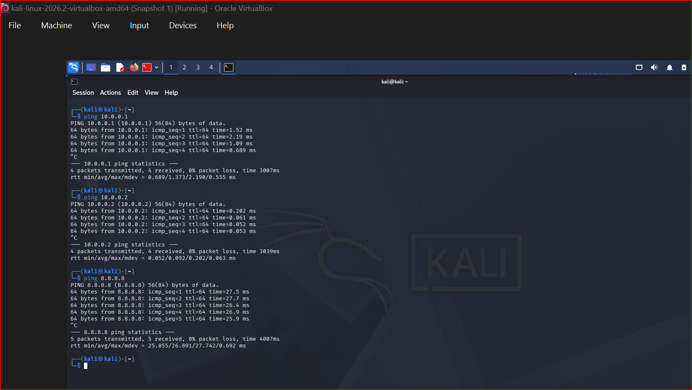
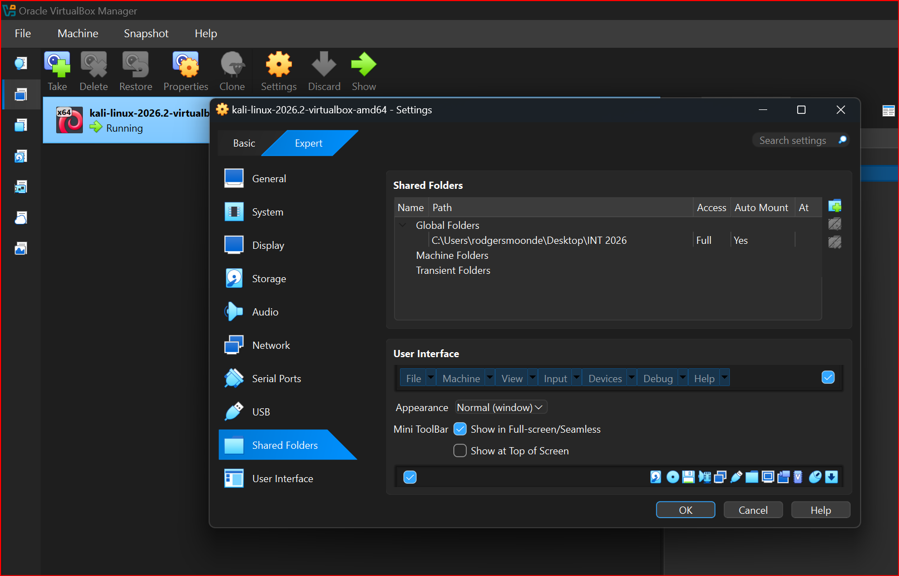
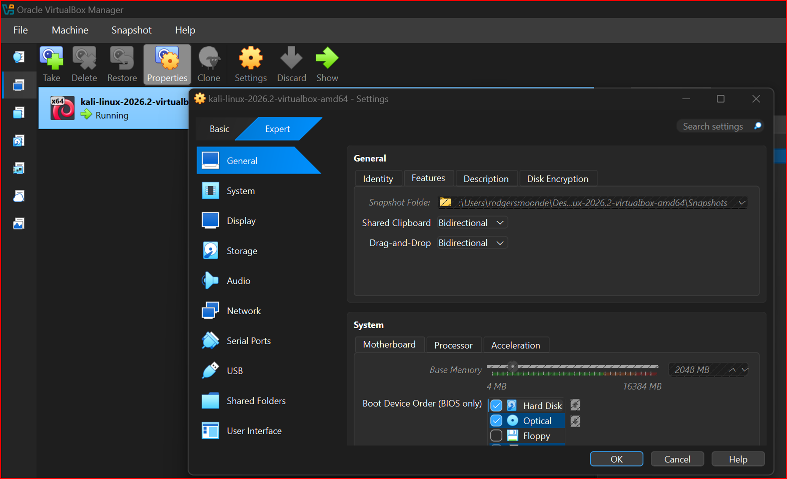

# Cybersecurity Testing Lab – Week 1

> **NetworkWalks Cybersecurity Internship | B083 | Week 1 | PM1**

A controlled cybersecurity testing laboratory designed and configured using **Windows 11, Oracle VirtualBox and Kali Linux**.

This project establishes the technical foundation for practical cybersecurity work, including network security, vulnerability assessment, penetration testing, security operations, incident response, digital forensics, risk assessment and cybersecurity best practices.

## Project Context

This repository documents my practical Week 1 internship work at **Networkwalks**, within the Cybersecurity Internship programme.

The internship scope includes exposure to network security, vulnerability assessment, penetration testing, security operations, incident response, digital forensics, risk assessment and cybersecurity best practices, together with hands-on training and real-world projects.

## Project Objective

The objective of Week 1 was to establish a controlled cybersecurity testing laboratory that can be used for authorized security testing, experimentation, validation and future practical cybersecurity exercises.

## Architecture

```text
                         INTERNET
                            |
                            |
                    Windows 11 Host
                            |
                     Oracle VirtualBox
                            |
                    VirtualBox NAT Network
                       10.0.0.0/24
                            |
                            |
                     Kali Linux VM
                       10.0.0.2/24
                            |
                  Cybersecurity Testing
```

## Environment

| Component | Configuration |
|---|---|
| Host OS | Windows 11 |
| Hypervisor | Oracle VirtualBox |
| Security VM | Kali Linux |
| Network Mode | NAT Network |
| Network | `10.0.0.0/24` |
| Kali IP | `10.0.0.2/24` |
| Internet Access | Enabled |
| Shared Folder | `/downloads` |
| Clipboard | Enabled |
| Drag & Drop | Enabled |

## Skills Demonstrated

### Infrastructure & Networking
- Virtual machine deployment
- Virtual networking
- IPv4 addressing
- NAT networking
- Network configuration
- Connectivity validation

### Cybersecurity
- Cybersecurity laboratory design
- Security testing environment preparation
- Kali Linux deployment
- Controlled security testing boundaries
- Preparation for vulnerability assessment and penetration testing

### Systems Administration
- Windows 11 host administration
- Linux virtual machine deployment
- VirtualBox configuration
- Host/VM integration
- Shared-folder configuration

### Security Engineering
- Controlled network segmentation
- Controlled file exchange
- Security testing boundaries
- CIA triad considerations
- Authorized testing methodology

## Evidence

Evidence is stored separately so that each screenshot can be mapped to a specific technical activity and competency.

### Virtualization




### Network Configuration






### Validation




### Host Integration




## Documentation

- [Week 1 Internship Report](docs/WEEK-01-INTERNSHIP-REPORT.md)
- [Lab Architecture](docs/LAB-ARCHITECTURE.md)
- [Evidence Matrix](docs/EVIDENCE-MATRIX.md)
- [Network Configuration](configuration/network-configuration.md)

## Week 1 Outcome

A functional cybersecurity testing laboratory was established using VirtualBox and Kali Linux. The laboratory provides the foundation for subsequent practical cybersecurity activities.

## Roadmap

### Week 1 – Laboratory Setup
- [x] VirtualBox environment
- [x] Kali Linux deployment
- [x] NAT Network
- [x] IP addressing
- [x] Internet connectivity
- [x] Shared folder
- [x] Clipboard integration
- [x] Drag-and-drop

### Future Practical Work
- [ ] Network reconnaissance
- [ ] Host and service enumeration
- [ ] Vulnerability assessment
- [ ] Controlled penetration testing
- [ ] Vulnerable target deployment
- [ ] Web application security testing
- [ ] Network traffic analysis
- [ ] Security monitoring
- [ ] Incident response exercises
- [ ] Digital forensics exercises
- [ ] Security hardening
- [ ] Risk assessment

## Ethical and Security Notice

This laboratory is intended for authorized cybersecurity training, research and experimentation.

Testing must only be performed against systems and networks that are owned by the tester or for which explicit authorization has been provided. Do not publish credentials, private keys, tokens, personal information, production configurations or other confidential information in this repository.

## Project Status

**Status:** Week 1 – Laboratory Setup Completed

**Next Phase:** Cybersecurity Testing and Validation

## Author

**Rodgers MOONDE**

ICT Management | Cybersecurity | Governance, Risk & Compliance
